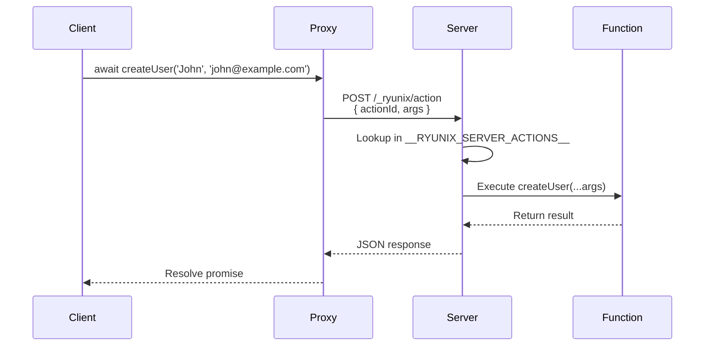

Server Actions are asynchronous functions defined in module files that enable seamless communication between frontend components and backend execution. By annotating files with the `// @server` directive, you can export functions that are callable from the client but executed securely on the Node.js server.

## Introduction

Server Actions eliminate the need for manual API route definitions, request/response handling, and serialization boilerplate. They provide a type-safe, function-call interface for server-side operations.

**Traditional Approach:**

```javascript Before: Manual API Route
// app/api/users/route.js
export async function POST(req, res) {
  const { name, email } = req.body
  const user = await db.users.create({ name, email })
  return res.json({ user })
}

// Component
const createUser = async (name, email) => {
  const response = await fetch('/api/users', {
    method: 'POST',
    headers: { 'Content-Type': 'application/json' },
    body: JSON.stringify({ name, email }),
  })
  const { user } = await response.json()
  return user
}
```

**Server Actions Approach:**

```javascript After: Server Action
// actions/users.js
// @server
export async function createUser(name, email) {
  const user = await db.users.create({ name, email })
  return user
}

// Component
import { createUser } from '../actions/users'

const user = await createUser('John', 'john@example.com')
```

<CardGroup cols={2}>
  <Card title="Type Safety" icon="shield">
    Full TypeScript support with inferred types across client/server boundary
  </Card>
  <Card title="Automatic Serialization" icon="sync">
    Arguments and return values automatically serialized/deserialized
  </Card>
  <Card title="Zero Boilerplate" icon="wand-magic-sparkles">
    No fetch calls, no API routes, no manual error handling
  </Card>
  <Card title="Secure by Default" icon="lock">
    Only exported functions are callable; implementation never sent to client
  </Card>
</CardGroup>

## How It Works

Server Actions are powered by the `ryunix-server-action-loader`, a custom Webpack loader that uses Babel AST transformations.

### Transformation Flow

<Steps>
  <Step title="Developer writes // @server file">
    Annotate file with `// @server` directive at the top
  </Step>
  <Step title="Webpack processes file twice">
    Once for client build (`target: 'web'`) and once for server build (`target: 'node'`)
  </Step>
  <Step title="Client Build: Replace with Proxy">
    Strips function bodies and replaces exports with `createActionProxy()` calls
  </Step>
  <Step title="Server Build: Register Functions">
    Preserves function bodies and appends registration code to global dictionary
  </Step>
  <Step title="Runtime: RPC Execution">
    Client proxy sends POST request, server looks up and executes function
  </Step>
</Steps>

### Architecture Diagram



## Defining Server Actions

### Basic Syntax

Create a file with the `// @server` directive:

```javascript actions/users.js
// @server
import { db } from '../lib/db'

export async function getUsers() {
  const users = await db.users.findMany()
  return users
}

export async function getUserById(id) {
  const user = await db.users.findUnique({ where: { id } })
  return user
}

export async function createUser(name, email) {
  const user = await db.users.create({ data: { name, email } })
  return user
}
```

<Note>
All exported functions **must** be `async`. Synchronous functions are ignored by the loader.
</Note>

### Directive Formats

Both comment styles are supported:

```javascript Valid Directives
// @server
//@server
//    @server
```

**Detection Regex:**

```javascript ryunix-server-action-loader.mjs:5
if (!/^\s*\/\/\s*@server/m.test(source)) {
  return source;
}
```

### Function Signatures

**Function Declarations:**

```javascript
export async function myAction(arg1, arg2) {
  // Implementation
}
```

**Arrow Functions:**

```javascript
export const myAction = async (arg1, arg2) => {
  // Implementation
}
```

**Function Expressions:**

```javascript
export const myAction = async function(arg1, arg2) {
  // Implementation
}
```

<Warning>
Default exports are **not** supported for Server Actions. Use named exports only.
</Warning>

## Client-Side Transformation

For client builds, the loader replaces function bodies with RPC proxies.

### Before Transformation

```javascript actions/users.js
// @server
export async function createUser(name, email) {
  const user = await db.users.create({ data: { name, email } })
  return user
}
```

### After Transformation (Client)

```javascript
import { createActionProxy as __ryunixCreateActionProxy } from '@unsetsoft/ryunixjs';

export const createUser = __ryunixCreateActionProxy("b7e4f2a9_createUser");
```

**Implementation Details:**

```javascript ryunix-server-action-loader.mjs:29
if (!isServer) {
  path.replaceWith(
    t.exportNamedDeclaration(
      t.variableDeclaration("const", [
        t.variableDeclarator(
          t.identifier(name),
          t.callExpression(
            t.identifier('__ryunixCreateActionProxy'),
            [t.stringLiteral(actionId)]
          )
        )
      ])
    )
  );
}
```

### Action Proxy Implementation

The `createActionProxy` function (from `@unsetsoft/ryunixjs`) returns a function that:

1. Accepts arbitrary arguments
2. Serializes arguments to JSON
3. Sends `POST /_ryunix/action` with `{ actionId, args }`
4. Deserializes and returns the response

**Proxy Pseudocode:**

```javascript
function createActionProxy(actionId) {
  return async (...args) => {
    const response = await fetch('/_ryunix/action', {
      method: 'POST',
      headers: { 'Content-Type': 'application/json' },
      body: JSON.stringify({ actionId, args }),
    })
    
    if (!response.ok) {
      const { error } = await response.json()
      throw new Error(error)
    }
    
    return await response.json()
  }
}
```

## Server-Side Transformation

For server builds, the loader preserves function bodies and appends registration code.

### Before Transformation

```javascript actions/users.js
// @server
export async function createUser(name, email) {
  const user = await db.users.create({ data: { name, email } })
  return user
}
```

### After Transformation (Server)

```javascript
export async function createUser(name, email) {
  const user = await db.users.create({ data: { name, email } })
  return user
}

// Ryunix Server Actions Registration
if (typeof globalThis.__RYUNIX_SERVER_ACTIONS__ === 'undefined') {
  globalThis.__RYUNIX_SERVER_ACTIONS__ = {};
}
globalThis.__RYUNIX_SERVER_ACTIONS__['b7e4f2a9_createUser'] = createUser;
```

**Registration Logic:**

```javascript ryunix-server-action-loader.mjs:71
if (isServer && actionNames.length > 0) {
  code += `\n\n// Ryunix Server Actions Registration`;
  code += `\nif (typeof globalThis.__RYUNIX_SERVER_ACTIONS__ === 'undefined') {`;
  code += `\n  globalThis.__RYUNIX_SERVER_ACTIONS__ = {};`;
  code += `\n}`;
  actionNames.forEach(name => {
    const actionId = `${hash}_${name}`;
    code += `\nglobalThis.__RYUNIX_SERVER_ACTIONS__['${actionId}'] = ${name};`;
  });
}
```

## Action ID Generation

Each Server Action gets a unique identifier:

```javascript ryunix-server-action-loader.mjs:11
import { createHash } from 'crypto';

const hash = createHash('sha256')
  .update(this.resourcePath)  // File path
  .digest('hex')
  .slice(0, 8);

const actionId = `${hash}_${functionName}`;
// Example: "b7e4f2a9_createUser"
```

**ID Components:**

- **File Hash**: SHA-256 of absolute file path (first 8 chars)
- **Function Name**: Original exported function name

**Benefits:**

- Collision-resistant (same function name in different files gets different IDs)
- Deterministic (same file always produces same hash)
- Human-readable (includes function name for debugging)

## RPC Endpoint

Both development and production servers handle Server Actions via `POST /_ryunix/action`.

### Development Server

```javascript webpack.config.mjs:401
devServer.app.use(async (req, res, next) => {
  if (req.method === 'POST' && req.url === '/_ryunix/action') {
    let body = '';
    req.on('data', chunk => { body += chunk; });
    req.on('end', async () => {
      try {
        const { actionId, args } = JSON.parse(body);
        const action = global.__RYUNIX_SERVER_ACTIONS__?.[actionId];
        
        if (!action) {
          res.writeHead(404, { 'Content-Type': 'application/json' });
          return res.end(JSON.stringify({ error: `Server Action ${actionId} not found` }));
        }
        
        const result = await action(...args);
        res.writeHead(200, { 'Content-Type': 'application/json' });
        res.end(JSON.stringify(result));
      } catch (err) {
        res.writeHead(500, { 'Content-Type': 'application/json' });
        res.end(JSON.stringify({ error: err.message }));
      }
    });
    return;
  }
  next();
});
```

### Production Server

Production server implements the same endpoint in `bin/prod.server.mjs`.

<Note>
See [CLI and Server](/webpack/cli-and-server#server-actions-middleware) for production implementation details.
</Note>

## Using Server Actions

### In Components

```javascript app/components/UserList.client.ryx
import { useStore, useEffect } from '@unsetsoft/ryunixjs'
import { getUsers, createUser } from '../actions/users'

export default function UserList() {
  const [users, setUsers] = useStore([])
  const [name, setName] = useStore('')
  const [email, setEmail] = useStore('')

  useEffect(() => {
    getUsers().then(setUsers)
  }, [])

  const handleSubmit = async (e) => {
    e.preventDefault()
    try {
      const newUser = await createUser(name, email)
      setUsers([...users, newUser])
      setName('')
      setEmail('')
    } catch (err) {
      console.error('Failed to create user:', err.message)
    }
  }

  return (
    <div>
      <h2>Users</h2>
      <ul>
        {users.map(user => (
          <li key={user.id}>{user.name} ({user.email})</li>
        ))}
      </ul>
      
      <form onSubmit={handleSubmit}>
        <input value={name} onChange={e => setName(e.target.value)} placeholder="Name" />
        <input value={email} onChange={e => setEmail(e.target.value)} placeholder="Email" />
        <button type="submit">Add User</button>
      </form>
    </div>
  )
}
```

### Error Handling

**Server-Side Errors:**

```javascript actions/auth.js
// @server
export async function login(email, password) {
  const user = await db.users.findUnique({ where: { email } })
  
  if (!user) {
    throw new Error('User not found') // Serialized to client
  }
  
  const valid = await bcrypt.compare(password, user.passwordHash)
  
  if (!valid) {
    throw new Error('Invalid password')
  }
  
  return { id: user.id, name: user.name }
}
```

**Client-Side Handling:**

```javascript
try {
  const user = await login(email, password)
  console.log('Logged in:', user)
} catch (err) {
  // err.message contains the server error message
  alert(`Login failed: ${err.message}`)
}
```

### Custom Error Types

```javascript actions/auth.js
// @server
class AuthError extends Error {
  constructor(message, code) {
    super(message)
    this.code = code
  }
}

export async function login(email, password) {
  const user = await db.users.findUnique({ where: { email } })
  
  if (!user) {
    throw new AuthError('User not found', 'USER_NOT_FOUND')
  }
  
  // ...
}
```

<Warning>
Custom error classes lose their prototype chain during serialization. Only `message` and enumerable properties are transmitted.
</Warning>

## Data Serialization

Server Actions use JSON for argument and return value serialization.

### Supported Types

<CardGroup cols={2}>
  <Card title="Primitives" icon="hashtag">
    `string`, `number`, `boolean`, `null`
  </Card>
  <Card title="Objects" icon="cube">
    Plain objects and arrays
  </Card>
  <Card title="Dates" icon="calendar">
    Serialized as ISO 8601 strings
  </Card>
  <Card title="Nested Data" icon="layer-group">
    Deeply nested objects and arrays
  </Card>
</CardGroup>

### Unsupported Types

<Warning>
The following types **cannot** be transmitted:

- Functions and methods
- Class instances (use plain objects)
- Symbols
- `undefined` (use `null`)
- Circular references
- `BigInt` (convert to string)
</Warning>

### Example: Valid Data

```javascript actions/posts.js
// @server
export async function createPost(data) {
  // data = {
  //   title: "Hello World",
  //   content: "Post content",
  //   published: true,
  //   publishedAt: "2026-03-14T12:00:00.000Z",
  //   tags: ["react", "ryunix"],
  //   metadata: { views: 0, likes: 0 },
  // }
  
  const post = await db.posts.create({ data })
  return post
}
```

### Example: Invalid Data

```javascript
// ❌ INVALID: Cannot pass functions
await createPost({
  title: "Hello",
  onClick: () => console.log('clicked'), // Error!
})

// ❌ INVALID: Cannot pass class instances
class Post {
  constructor(title) { this.title = title }
}
await createPost(new Post('Hello')) // Error!

// ✅ VALID: Use plain objects
await createPost({ title: 'Hello' })
```

## Authentication & Authorization

Server Actions have access to request context for auth checks.

### Accessing Request Context

```javascript actions/users.js
// @server
import { getSession } from '../lib/session'

export async function getCurrentUser() {
  const session = await getSession()
  
  if (!session?.userId) {
    throw new Error('Unauthorized')
  }
  
  const user = await db.users.findUnique({ where: { id: session.userId } })
  return user
}

export async function updateProfile(data) {
  const session = await getSession()
  
  if (!session?.userId) {
    throw new Error('Unauthorized')
  }
  
  const user = await db.users.update({
    where: { id: session.userId },
    data,
  })
  
  return user
}
```

### Role-Based Access Control

```javascript actions/admin.js
// @server
import { getSession } from '../lib/session'

function requireAdmin() {
  const session = await getSession()
  
  if (!session?.userId) {
    throw new Error('Unauthorized')
  }
  
  const user = await db.users.findUnique({ where: { id: session.userId } })
  
  if (user.role !== 'ADMIN') {
    throw new Error('Forbidden')
  }
  
  return user
}

export async function deleteUser(userId) {
  await requireAdmin()
  await db.users.delete({ where: { id: userId } })
  return { success: true }
}
```

## Advanced Patterns

### Optimistic Updates

```javascript app/components/LikeButton.client.ryx
import { useStore } from '@unsetsoft/ryunixjs'
import { likePost } from '../actions/posts'

export default function LikeButton({ postId, initialLikes }) {
  const [likes, setLikes] = useStore(initialLikes)
  const [optimistic, setOptimistic] = useStore(false)

  const handleLike = async () => {
    setOptimistic(true)
    setLikes(likes + 1) // Optimistic update
    
    try {
      const { likes: actualLikes } = await likePost(postId)
      setLikes(actualLikes) // Server confirmation
    } catch (err) {
      setLikes(likes) // Rollback on error
      console.error('Like failed:', err.message)
    } finally {
      setOptimistic(false)
    }
  }

  return (
    <button onClick={handleLike} disabled={optimistic}>
      ❤️ {likes}
    </button>
  )
}
```

### Pagination

```javascript actions/posts.js
// @server
export async function getPosts(page = 1, limit = 10) {
  const posts = await db.posts.findMany({
    skip: (page - 1) * limit,
    take: limit,
    orderBy: { createdAt: 'desc' },
  })
  
  const total = await db.posts.count()
  
  return {
    posts,
    page,
    limit,
    total,
    hasMore: page * limit < total,
  }
}
```

### File Uploads

Server Actions can't directly handle file uploads (use API routes instead), but you can upload to a CDN and pass the URL:

```javascript
// 1. Upload file to CDN from client
const formData = new FormData()
formData.append('file', file)

const response = await fetch('/api/upload', {
  method: 'POST',
  body: formData,
})

const { url } = await response.json()

// 2. Pass URL to Server Action
await createPost({ title, content, coverImage: url })
```

## Debugging

### Inspecting Registered Actions

In development, inspect the global registry:

```javascript
// In Node.js console or server-side code
console.log(Object.keys(globalThis.__RYUNIX_SERVER_ACTIONS__))
// [
//   "b7e4f2a9_getUsers",
//   "b7e4f2a9_createUser",
//   "c3f8a1d2_login",
//   "c3f8a1d2_register"
// ]
```

### Network Inspection

Server Action calls appear in DevTools Network tab:

**Request:**

```http
POST /_ryunix/action
Content-Type: application/json

{
  "actionId": "b7e4f2a9_createUser",
  "args": ["John Doe", "john@example.com"]
}
```

**Response:**

```http
200 OK
Content-Type: application/json

{
  "id": "user_123",
  "name": "John Doe",
  "email": "john@example.com"
}
```

### Common Errors

**404: Server Action not found**

```
Server Action b7e4f2a9_createUser not found
```

**Causes:**
- File not processed by server compiler
- Function not exported
- Function is not async
- Missing `// @server` directive

**500: Execution error**

```
Database connection failed
```

**Causes:**
- Unhandled exception in server function
- Database/network errors
- Invalid arguments

## Performance Considerations

### Network Overhead

Each Server Action call is an HTTP request:

- **Latency**: ~10-50ms (LAN) or ~100-300ms (Internet)
- **Payload**: JSON serialization overhead

**Optimization:**

```javascript
// ❌ BAD: N+1 queries
for (const id of userIds) {
  const user = await getUserById(id) // N requests!
}

// ✅ GOOD: Batch query
const users = await getUsersByIds(userIds) // 1 request
```

### Caching

Implement server-side caching for expensive operations:

```javascript actions/posts.js
// @server
import { cache } from '../lib/cache'

export async function getPopularPosts() {
  const cached = await cache.get('popular_posts')
  if (cached) return cached
  
  const posts = await db.posts.findMany({
    orderBy: { views: 'desc' },
    take: 10,
  })
  
  await cache.set('popular_posts', posts, { ttl: 300 }) // 5 min
  return posts
}
```

### Parallel Execution

```javascript
// ❌ SEQUENTIAL: 300ms total
const users = await getUsers()      // 100ms
const posts = await getPosts()      // 100ms
const comments = await getComments() // 100ms

// ✅ PARALLEL: 100ms total
const [users, posts, comments] = await Promise.all([
  getUsers(),
  getPosts(),
  getComments(),
])
```

## TypeScript Support

Server Actions work seamlessly with TypeScript:

```typescript actions/users.ts
// @server
import { db } from '../lib/db'
import type { User } from '@prisma/client'

export async function getUsers(): Promise<User[]> {
  const users = await db.users.findMany()
  return users
}

export async function createUser(
  name: string,
  email: string
): Promise<User> {
  const user = await db.users.create({ data: { name, email } })
  return user
}
```

**Client Usage (Full Type Safety):**

```typescript app/components/UserList.client.tsx
import { createUser } from '../actions/users'
import type { User } from '@prisma/client'

// TypeScript infers return type as Promise<User>
const user = await createUser('John', 'john@example.com')
//    ^? const user: User
```

## Limitations

<Warning>
**Known Limitations:**

1. Only **named async exports** are supported
2. Arguments and return values must be **JSON-serializable**
3. No direct access to `Request`/`Response` objects (use context helpers)
4. Cannot stream responses (use API routes for SSE/WebSockets)
5. No middleware chaining (implement guards within actions)
</Warning>

## Migration from API Routes

**Before (API Route):**

```javascript app/api/posts/route.js
export async function GET(req, res) {
  const posts = await db.posts.findMany()
  return res.json({ posts })
}

export async function POST(req, res) {
  const { title, content } = req.body
  const post = await db.posts.create({ data: { title, content } })
  return res.json({ post })
}
```

**After (Server Actions):**

```javascript actions/posts.js
// @server
export async function getPosts() {
  const posts = await db.posts.findMany()
  return posts
}

export async function createPost(title, content) {
  const post = await db.posts.create({ data: { title, content } })
  return post
}
```

**Benefits:**

- 50% less code
- No manual request/response handling
- Type-safe client imports
- Automatic serialization

## Related

<CardGroup cols={2}>
  <Card title="Custom Loaders" icon="gear" href="/webpack/loaders">
    Technical deep dive into the Server Actions loader implementation
  </Card>
  <Card title="Routing, SSR & SSG" icon="route" href="/webpack/routing-ssr-ssg">
    How Server Actions integrate with file-system routing
  </Card>
</CardGroup>